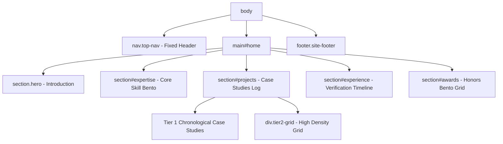

Here is a comprehensive breakdown of the portfolio's **UI/UX architecture, Design System, Layout Hierarchy, and Interactivity** to help you present or explain its design choices.

---

### 🎨 1. The Design System

#### **Color Palette & Visual Theme**
The site uses a premium **dark mode theme** tailored to the aesthetics of modern developer IDEs and scientific dashboards.
* **Primary Canvas (`#0B0F19` to `#111827`):** A deep slate-black background layered with a technical grid overlay mask and soft radial glows (Cyan and Violet). This mimics the depth of a dark terminal editor and reduces eye strain.
* **Surface Cards (`#1E293B` / Semi-Transparent Slate):** Card containers use a gradient background (`#1E293B` to `#0F172A`) with thin slate borders (`#334155`). This defines clean boundaries without looking heavy.
* **Accent AI (`#06B6D4` - Electric Cyan):** Used for Data Science, PyTorch models, and Machine Learning highlights to represent intelligence, precision, and research.
* **Accent Web3 (`#A855F7` - Hyper Violet):** Used for Solana, on-chain state, and systems engineering to represent cryptography and decentralization.
* **Typography Hierarchy:** Headings use high-contrast white (`#F8FAFC`), descriptions use muted slate (`#94A3B8`), and annotations/labels use a dimmed blue-grey (`#64748B`).

#### **Typography**
* **Display Font (`Space Grotesk`):** A geometric, wide-sans typeface with tech-inspired terminals. Used for headings (`h1`, `h2`, `h3`) to create a bold, structural brand voice.
* **Body Font (`Inter`):** A highly readable, neutral sans-serif optimized for interfaces. Used for descriptive paragraphs, labels, and menus.
* **Monospace Font (`JetBrains Mono` / `Geist Mono`):** Used for accuracy scores (e.g., `96% F1`), dimension metrics, CLI log files, timestamps, and tech badges to convey authentic engineering depth.

---

### 📐 2. Layout Hierarchy & UX Design

* **Hero Section (The Hook):** Divides the viewport into copy on the left and a hardware-themed framed profile photograph on the right. Below the photo is a mock diagnostic status bar (`STATUS: READY`, `LOC: ID // MN`) that immediately establishes a high-tech theme.
* **Bento Grid (Expertise Section):** Uses asymmetrical bento cards to break up content. One card features a stylized SVG representation of **Transformer Self-Attention Weights**, reinforcing deep learning expertise visually.
* **Featured Projects (Tier 1 alternating rows):** Alternates column layouts (Media Left & Copy Right, then Copy Left & Media Right) separated by a generous `128px` spacing. This layout forces readers to pause and evaluate each system individually as a detailed case study rather than skimming a list.
* **High-Density Grid (Tier 2 supporting systems):** Houses secondary projects in a compact 3-column card grid. The legacy project card uses `opacity-60` to lower its visual prominence, ensuring recruiters focus on recent machine learning achievements.

---

### ⚡ 3. Interactivity & Micro-Animations

The portfolio uses smooth, hardware-accelerated micro-animations to feel "alive" and interactive without compromising load speeds:

* **Scroll Progress Bar:** A thin gradient line at the bottom of the navigation bar scales dynamically from 0% to 100% based on the user's scroll progress.
* **Intersection Reveal Observer:** As users scroll down, sections slide up slightly and fade in (`.section-reveal`), creating a fluid reading flow.
* **Full-Image Hover Crossfading:** Hovering over cards (like CORA or the Awards grid) triggers a smooth absolute transition (`opacity: 1`) that swaps the cover photo for a detail photo (e.g., swapping a landing page for gameplay), maximizing space usage.
* **Live CLI Stream Emulation (Socratix):** Inside the Socratix card, a terminal window streams server logs sequentially using CSS keyframe delays (`fadeInLine`). A blinking monospace cursor is placed at the end to make it look like a running server.
* **Interactive Matrix Tab Toggle (Aksara):** Allows recruiters to click the tab button to toggle the DOM view (`[hidden]`) between the Confusion Matrix and feature interpretation overlays.
* **Details Modal Overlay (Awards):** To prevent text cluttering on the card faces, detailed field outcomes are bound to an interactive pop-up modal with a background blur (`backdrop-filter: blur(14px)`).

Edited design_sytem.md
Viewed design_sytem.md:35-40

Here is a detailed breakdown of the portfolio's **structural blueprint and content hierarchy**, detailing the purpose of each section and why it is written this way:

---

### 📂 1. Structural Blueprint (DOM Anatomy)

The document is organized inside a semantic HTML5 structure:

1. **`nav.top-nav` (Global Header):**
   * **Purpose:** Houses persistent brand identity (`GP_RINDENGAN.IO`) and navigation anchors.
   * **UX Choice:** Uses a glassmorphism backdrop (`backdrop-filter: blur(18px)`) to stay legible above background details while scrolling.

2. **`section.hero` (Primary Entrypoint):**
   * **Purpose:** Immediate positioning.
   * **UX Choice:** Includes a monospaced "Diagnostic Ribbon" (`.credential-ribbon`) at the base, displaying high-value stats (CGPA, PIMNAS Bronze, Gemastik Finalist, Core Stack) to hook recruiters within the first 3 seconds of load time.

3. **`section#expertise` (Core Skill Bento):**
   * **Purpose:** Summarizes research and system architecture capabilities.
   * **Content Flow:** Grouped into 3 visual Bento cards: Deep Learning (conceptual focus), Web3 & Systems (infrastructure focus), and a structural tag-cloud of production tools.

4. **`section#projects` (Featured Case Studies):**
   * **Purpose:** The core evidence layer of the portfolio.
   * **Content Flow:** 
     * **Tier 1 (Alternating Rows):** Detailed, multi-column case studies sorted from latest (April 2026) to oldest (July 2025).
     * **Tier 2 Grid (Supporting Systems):** A compact 3-column grid for utility backends and database schemas, saving screen height.

5. **`section#experience` (Verification Timeline):**
   * **Purpose:** Outlines professional applications (PT. Bank SulutGo and UNSRAT IT Community).
   * **UX Choice:** Employs collapsable timeline accordions (`.timeline-item`) displaying verification scorecards and cohort photographs.

6. **`section#awards` (Honors Bento Grid):**
   * **Purpose:** Displays credentials on national competitions.
   * **UX Choice:** Uses a dynamic Javascript renderer (`setupAwards()`) to populate data cards from a single config file (`script.js`), simplifying updates.

---

### 📝 2. Content & Copywriting Strategy

The copy is written using **recruiter-optimized engineering verbs and quantitative evidence**:

#### **Data Science Focus**
Every deep learning project explicitly lists **model architectures** and **quantified accuracy scores** instead of general sentences:
* *Aksara Classification:* Mentions "Co-Scale Conv-Attentional Image Transformers (CoaT)" and "Swin Transformers" alongside a concrete **96% F1-score**.
* *Fish Freshness:* Mentions "Parallel Cross-Attention Fusion System", "Contrastive Learning", and a peak **92.7% F1-score**.
* *Public Facility:* Focuses on "Association Rule Data Mining (Apriori and Eclat)" to establish scientific grounding.

#### **Distributed Systems Focus**
Infrastructure projects focus on performance, safety constraints, and backend state machines:
* *CORA Game:* Focuses on "high-throughput matchmaking", "Bun/Hono WebSockets", and "cryptographic settlement oracles".
* *Socratix Tutor:* Details "Multi-Agent Pipeline inside NestJS" and "Deterministic AST Validation using Math.js" to show defensive software engineering practices.
* *JTEHub:* Emphasizes "timezone-safe scheduling verification loops" and "JWT passport guards".